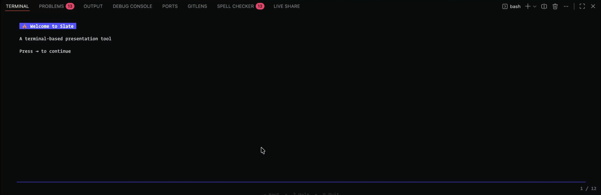

<p align="center">
  
</p>

# 🌗 Slate


- **Markdown Rendering**: Full markdown support with syntax highlighting via Glamour
- **Beautiful Themes**: Dark and light themes with customizable color schemes
- **Smooth Navigation**: Intuitive keyboard shortcuts for seamless slide transitions
- **Progress Indicators**: Visual progress bar and slide numbers
- **Command Footer**: Context-aware navigation hints shown at the bottom of every slide
- **Smart Exit**: Auto-exit when pressing "next" on the last slide
- **Customizable**: Configure themes, keybindings, and presentation settings via YAML
- **Navigation History**: Go back to previously viewed slides
- **Cross-Platform**: Works on macOS, Linux, and Windows

---

## ⚡ Features

- **Clean Architecture**: Domain-driven design with clear separation of concerns
- **Pre-configured Tooling**:
  - **Pre-commit**: Hooks to enforce consistency before commits.
  - **Testing**: Comprehensive testing setup with mocks and fixtures
- **Modular Structure**: Organized packages for scalability and maintainability
- **CI/CD**: GitHub Actions workflows for testing and deployment
- **Security**: Built-in security middleware and best practices

---

## 🚀 Getting Started

### Prerequisites

Ensure you have the following installed:

- **Go**: v1.25 or later
- **Make**: For running build commands (optional)

---

### ⚙️ Installation

1. **Clone the repository:**

   ```bash
   git clone https://github.com/Kosha-Nirman/slate.git
   cd slate
   ```

2. **Install dependencies:**

   ```bash
   go mod tidy
   ```

3. **Run the application:**

   ```bash
   go run src/cmd/main.go
   ```

4. **Or use Make commands:**

   ```bash
   make run
   ```

---

## Quick Start

### 1. Create a Sample Presentation

```bash
slate init my-slides.md
```

This creates a sample markdown presentation with example slides.

### 2. Present Your Slides

```bash
slate present my-slides.md
```

### 3. Navigate Your Presentation

- **Next slide**: →, L
- **Previous slide**: ←, H
- **First slide**: Home, G
- **Last slide**: End, Shift+G
- **Go back**: B
- **Show help**: ?
- **Quit**: Q, Esc, Ctrl+C

**💡 Pro Tip**: When you reach the last slide, pressing → or Space will automatically exit the presentation! Navigation commands are shown at the bottom of every slide.

---

## Creating Presentations

Presentations are written in markdown. Use horizontal rules (`---`) to separate slides:

---

## Configuration

### View Current Configuration

```bash
slate config show
```

### Create Configuration File

```bash
slate config init
```

This creates a configuration file at `~/.config/slate/slate.yaml`.

### Configuration Options

```yaml
theme:
  mode: auto          # auto, dark, or light
  glamourStyle: dark  # dark, light, dracula, pink
  showProgress: true
  showSlideNum: true

presentation:
  wordwrap: 80
  margin: 2
  padding: 1

keybindings:
  next:
    - right
    - l
  previous:
    - left
    - h
  first:
    - home
    - g
  last:
    - end
    - G
  quit:
    - q
    - esc
    - ctrl+c
```

---

## Commands

### `slate present <file>`

Present a markdown file as slides.

```bash
slate present slides.md
```

### `slate init [filename]`

Create a sample presentation.

```bash
slate init
slate init my-talk.md
```

### `slate config`

Manage configuration.

```bash
slate config show      # Show current configuration
slate config init      # Create default config file
slate config path      # Show config file path
slate config example   # Show example configuration
```

---

## Demo



---

## Built With

- [Bubble Tea](https://github.com/charmbracelet/bubbletea) - TUI framework
- [Glamour](https://github.com/charmbracelet/glamour) - Markdown rendering
- [Lipgloss](https://github.com/charmbracelet/lipgloss) - Style definitions
- [Cobra](https://github.com/spf13/cobra) - CLI framework
- [yaml.v3](https://gopkg.in/yaml.v3) - YAML parser

---

## 📜 License

This project is licensed under the MIT License. See the [LICENSE](LICENSE.md) file for details.

---

## 🙌 Acknowledgments

- Built for developers who value **maintainable** and **scalable** code
- Inspired by tools like [slides](https://github.com/maaslalani/slides) and reveal.js
- Perfect for developers who love the terminal
